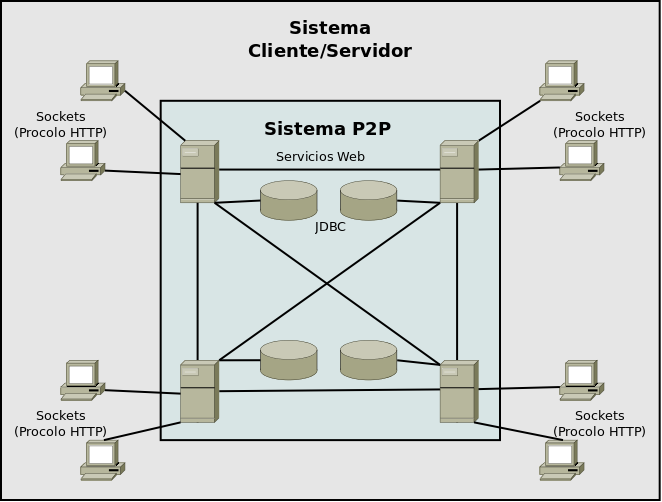
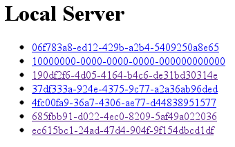
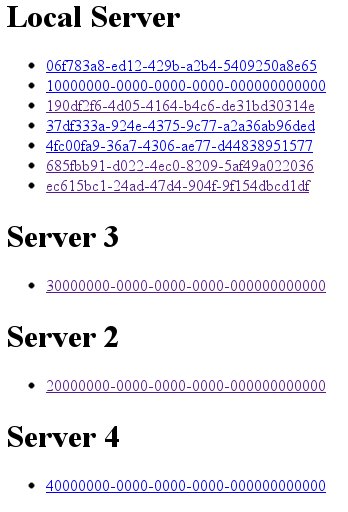

# Servidor Híbrido de Documentos Estructurados

## Objetivo

El objetivo principal de esta práctica es el desarrollo de un proyecto en el cual se apliquen las herramientas y tecnologías vistas en la asignatura.

Este proyecto consistirá en el desarrollo de un sistema híbrido cliente/servidor y P2P para la gestión de documentos estructurados (HTML y XML). Este proyecto se desarrollará en dos partes que coincidirán con las dos entregas a realizar.

Como primera parte del proyecto se desarrollará un sistema similar a un servidor Web, con la diferencia de que las páginas servidas se solicitarán mediante un identificador y que estas estarán almacenadas en una base de datos relacional. En esta primera parte el sistema solo tendrá soporte para páginas HTML.

En la segunda parte del proyecto se desarrollará el sistema P2P y se añadirá soporte para XML. El sistema P2P permitirá que cada servidor pueda servir cualquier página almacenada en cualquier servidor de la red P2P. Por lo tanto, si un servidor recibe un identificador de página desconocido deberá consultar al resto de los servidores de la red si lo conocen y, en tal caso, solicitar el documento y servirlo al cliente.

## Entorno

En el desarrollo de este proyecto debe utilizarse:

* Java 11
* MySQL 8+
* Maven 3.6+
* Git 2+ (en el caso de querer hacer commits, lo cual es recomendable)

Es importante que antes de empezar a trabajar se edite el fichero `pom.xml` para:

* Poner en la propiedad `group.name` el nombre del grupo en Moovi.
* Descomentar y completar la sección `developers` con los datos de los miembros del grupo.

### Comandos útiles
Algunos comandos Maven que te serán útiles son:

* `mvn test`: ejecuta los tests y genera un informe en `target/site/surefire-report.html`.
* `mvn exec:java`: ejecuta la aplicación (es decir, ejecuta `Launcher`).
* `mvn exec:java -Dexec.args="arg1 arg2 arg3"`: ejecuta la aplicación con los parámetos `arg1 arg2 arg3`. Por ejemplo, `mvn exec:java -Dexec.args="config.props"` ejecuta `Launcher` pasándole el parámetro `config.props`.
* `mvn package`: empaqueta la aplicación. Generará un fichero `hybrid-server-<nombre del grupo>.r1.tar.gz` en la raíz del proyecto que es el que habrá que entregar en Moovi en la primera entrega.

## Arquitectura

La Figura 1 muestra la arquitectura general del sistema. Como se puede observar, la parte Cliente/Servidor (C/S) está claramente diferenciada de la parte P2P. Una importante diferencia entre ambas es que en la parte C/S los clientes interactuarán con los servidores, mientras que la parte P2P está reservada a la comunicación entre servidores.


*Figura 1. Arquitectura general del sistema*

### Gestión de contenidos

El sistema final deberá tener soporte para servir páginas HTML y XML. Mientras que las páginas HTML serán servidas sin modificación desde la base de datos, las páginas XML podrán solicitarse con una plantilla XSLT asociada, debiéndose aplicar dicha plantilla antes de ser servida. Además, las plantillas XSLT tendrán un esquema XSD asociado, por lo que antes de aplicar dicha plantilla habrá que validar el documento XML contra dicho esquema.

Todos los contenidos se alojarán en una base de datos en cada servidor y tendrán asociado un identificador único para todo el sistema, que podrá ser generado utilizando la clase `java.util.UUID`. Cuando se solicite un contenido se hará haciendo uso de este identificador.

### Comunicación

La comunicación entre cliente y servidor se realizará utilizando el protocolo HTTP, de tal modo que cualquier navegador web actual (p.ej. Mozilla Firefox, Chrome/Chromium, Safari, etc.) pueda ser utilizado como cliente. No es necesario un soporte completo del protocolo, tan solo el suficiente como para cubrir los requisitos indicados en la siguiente sección.

Algunas de las simplificaciones sobre este protocolo que se tendrán en cuenta son que no será necesario soportar el modo de conexión “keep-alive” y que siempre se utilizará la codificación de caracteres UTF-8.

La comunicación entre servidores se realizará utilizando servicios Web, de tal modo que cada servidor podrá invocar comandos en cualquier otro servidor de la red P2P. Este será el medio por el cual se obtendrá información de las páginas alojadas en otros servidores.

## Requisitos

En esta sección se detallan los requisitos que debe cumplir la aplicación en forma de funcionalidades. Dependiendo de si dichas funcionalidades deben ser implementadas para la primera o segunda entrega, se identifican con AX o BX, respectivamente.

En cada requisito se indica la puntuación asociada, que en cada entrega será sobre un máximo de 10 puntos. La documentación y el formato de entrega también se tendrán en cuenta en la puntuación, restando hasta un máximo de 1 punto en el caso de que existan errores o incumplimientos.

De forma adicional a lo descrito en estos puntos, también debe tenerse en cuenta que no respetar las buenas prácticas descritas en los distintos temas de teoría supondrá una penalización en la puntuación. Así, por ejemplo, no cerrar flujos o conexiones cuando ya no son utilizadas.
Adicionalmente, debe tenerse en cuenta que los tests incluidos en el proyecto base y los que se entregarán para la segunda entrega incluyen detalles de implementación que son obligatorios (p.ej. evalúan el `Content-Type` devuelto por algunas respuestas), por lo que no superar los tests puede suponer una penalización en la nota final.

En Moovi se detallarán las normas de evaluación, realización, entrega y defensa del proyecto.

## A. Primera entrega

### A1. Servir una página HTML [GET] (3 puntos)

El sistema debe ser capaz de servir una página Web alojada en su base de datos. La petición HTTP deberá hacerse con el método `GET` sobre el recurso `html` y con el parámetro `uuid` al que se le asignará el identificador de la página Web que se desea recuperar.

Así, por ejemplo, para solicitar a un servidor local escuchando en el puerto 2000 la página con identificador “12345678-1234-1234-1234-123456789012” (este es el formato de identificador proporcionado por `java.util.UUID`), el cliente deberá introducir la siguiente URL en su navegador:

http://localhost:2000/htm?uuid=12345678-1234-1234-1234-123456789012

#### Página de Bienvenida

Cuando un usuario acceda a la dirección raíz (p.ej. http://localhost:2000) se le servirá una **página de bienvenida donde aparecerá, al menos, el nombre “Hybrid Server” y los autores del proyecto**. También puede haber, por ejemplo, un enlace al listado de páginas del servidor (ver siguiente punto) o la descripción de la configuración del mismo, pero esto no es obligatorio.

Es importante tener en cuenta que esta página siempre debe funcionar, independientemente de que exista conexión con la base de datos o no. Por lo tanto, establecer conexión con la base de datos para servir este página será un error.

#### Listado de páginas

Si un cliente hace una petición sobre el recurso `html` sin ningún parámetro se listarán los enlaces a todas las páginas HTML almacenadas en el servidor con una página similar a la mostrada en la Figura 2.


*Figura 2. Lista de documentos HTML de un servidor*

#### A2. Añadir una nueva página HTML [POST] (2 puntos)

El sistema debe ser capaz de añadir nuevas páginas Web a su base de datos, asignándoles un nuevo identificador único. Estas páginas se recibirán en el parámetro `html` de una petición con el método `POST` sobre el recurso `html`.

Un formulario HTML adaptado a este tipo de petición podría ser el siguiente:

```html
<form action=”http://localhost:2000/html” method=”POST”>
   <textarea name=”html”></textarea>
   <button type=”submit”>Submit</button>
</form>
```

La respuesta a esta petición debe ser una página HTML con un hiperenlace a la página recién añadida, cuyo texto sea el identificador asignado.

También es posible utilizar alguna herramienta tipo [Postman](https://www.postman.com/), [RESTClient](https://addons.mozilla.org/es/firefox/addon/restclient/) o [Talend API Tester](https://chrome.google.com/webstore/detail/talend-api-tester-free-ed/aejoelaoggembcahagimdiliamlcdmfm) para hacer peticiones POST de una forma sencilla.

#### A3. Eliminar una página HTML [DELETE] (2 puntos)

El sistema debe ser capaz de eliminar una página Web alojada en su base de datos. Para ello se deberá hacer una petición HTTP al servidor sobre el recurso `html` utilizando el método `DELETE` e incluyendo el parámetro `uuid` con el identificador de la página a eliminar. Solo se debe eliminar dicho contenido de la base de datos si se corresponde con una página HTML.

Este tipo de peticiones puede realizarse, por ejemplo, utilizando el comando `curl` de los sistemas Linux. Así, por ejemplo, si se desea eliminar la página con identificador “12345678-1234-1234-1234-123456789012” de un servidor local activo en el puerto 2000, se podrá utilizar el siguiente comando:

```bash
curl -X DELETE http://localhost:2000/html?uuid=12345678-1234-1234-1234-123456789012
```

La respuesta a esta petición deberá ser una página web con un mensaje que indique se se ha eliminado dicha página.

También es posible utilizar alguna herramienta tipo [Postman](https://www.postman.com/), [RESTClient](https://addons.mozilla.org/es/firefox/addon/restclient/) o [Talend API Tester](https://chrome.google.com/webstore/detail/talend-api-tester-free-ed/aejoelaoggembcahagimdiliamlcdmfm) para hacer peticiones `DELETE` de una forma sencilla.

#### A4. Manejo de errores (1 punto)

El sistema deberá manejar correctamente los errores, evitando que finalice la ejecución de un servidor bruscamente y comunicándose debidamente con los clientes. Para ello, en el caso de que en alguna las tres peticiones anteriores (y en las descritas posteriormente) se produzca un error en el servidor (normalmente, por el lanzamiento de una excepción), este deberá responder al cliente con un mensaje con código 500 (*Internal server error*) y continuar su ejecución. Además, si el cliente solicita una página que no existe el servidor deberá responder con un código 404 (*Not found*) y, si la solicitud es incorrecta, deberá responder con un código 400 (*Bad Request*).

Como parte del manejo de errores es importante tener en cuenta que, en el caso de que se pierda o no se pueda establecer conexión con la base de datos el servidor debe seguir funcionando correctamente, devolviendo un código 500 en el caso de que la petición requiera conexión con la base de datos. Además, en el momento en el que la base de datos vuelva a funcionar correctamente, el servidor debe continuar funcionando de forma normal.

#### A5. Servicio a Múltiples Usuarios (1 punto)

El servidor deberá ser capaz de atender a varios clientes simultáneamente evitando, en cualquier caso, descartar clientes por exceso de peticiones. El número de clientes al que se dará servicio de forma simultánea será un parámetro de la configuración del sistema (ver siguiente punto). Las peticiones de aquellos clientes en exceso de este parámetro quedarán suspendidas hasta que se liberen los recursos necesarios.

#### A6. Configuración y Ejecución (1 punto)

Toda la configuración del servidor deberá alojarse en un fichero externo, cuya ubicación será el único parámetro que recibirá el sistema al ejecutarse. Por lo tanto, la ejecución de un servidor se realizará de la siguiente forma:

```bash
java es.uvigo.esei.dai.hybridserver.Launch config.conf
```

Este fichero debe incluir, los siguientes elementos de configuración:

* Puerto de servicio de HTTP. Para la comunicación con los clientes.
* Número de clientes a los que se les podrá dar servicio de forma simultánea.
* Datos de configuración de la conexión con la base de datos (URL, usuario y password).

Es recomendable utilizar, para la primera parte, un fichero de propiedades de Java, gestionado mediante la clase java.util.Properties.

En concreto, en la primera entrega, el fichero de configuración debe contener los siguientes campos (debe respetarse mayúsculas y minúsculas):

```
numClients=
port=
db.url=
db.user=
db.password=
```

**En el caso de que no se le pase un fichero de configuración, se utilizarán los siguientes parámetros como parámetros por defecto**:

```
numClients=50
port=8888
db.url=jdbc:mysql://localhost:3306/hstestdb
db.user=hsdb
db.password=hsdbpass
```

**En el caso de que se reciba más de un parámetro deberá mostrarse un mensaje de error explicando cómo ejecutar correctamente la aplicación.**

## B. Segunda Entrega

La segunda entrega está centrada en la inclusión de XML y en el servicio P2P.

#### B1. Soporte para XML (2 puntos)

El sistema deberá soportar ficheros XML de la misma forma que soporta HTML, es decir, permitiendo solicitar, crear y eliminar documentos XML. Existirán dos diferencias principales:

1. Las peticiones deberán dirigirse al recurso `xml` en lugar de `html` y en la creación de un nuevo documento (petición `POST`) el documento estará asignado al parámetro `xml` en lugar de al parámetro `html`.
2. En las solicitudes `GET`, el cliente podrá incluir el parámetro `xslt` con el identificador de una plantilla XSLT alojada en el sistema. En tal caso, el sistema deberá recuperar dicha plantilla y el esquema asociados (ver siguiente punto), validar el XML con el esquema y, en el caso de que se supere la validación, devolver el resultado de transformar el documento XML con la plantilla XSLT.

#### B2. Soporte para XSLT y XSD (2 puntos)

El sistema deberá soportar ficheros XSD y XSLT de la misma forma que soporta HTML y XML, es decir, permitiendo solicitar, crear y eliminar documentos XSD y XSLT. En este caso existen las siguientes particularidades:

1. Cuando se sube un fichero de plantilla XSLT (petición `POST`) deberá incluirse el parámetro `xsd` con el identificador de un esquema asociado. Este será el esquema que se utilizará para validar un XML cuando se solicite con un XSLT asociado.
2. En el caso de que no se proporcione el parámetro `xsd` en la petición se dará una respuesta 400 (*Bad Request*).
3. En el caso de que el XSD que se quiera asociar a un XSLT no exista, deberá devolverse un 404 (*Not Found*).

#### B3. Sistema P2P (5 puntos; mínimo 2 puntos)

Deberá crearse un sistema P2P para la comunicación entre servidores, te tal forma que cuando un cliente solicite un recurso los servidores lo busquen en todos los *hosts* del sistema P2P. De este modo, cuando un cliente solicite un documento HTML o XML, si el servidor al que hace la solicitud no lo contiene lo buscará en otros servidores. Esto incluye los documentos XSD y XSLT.

En el caso de las páginas de listados de contenido (peticiones `GET` sin `uuid`), se mostrará el contenido de todos los servidores de la red, con una página similar a la mostrada en la Figura 3.


*Figura 3. Listado de documentos de la red P2P*

Debe tenerse en cuenta que los enlaces de los servidores remotos deben llevar a esos servidores y no al servidor que está mostrando el listado.

<span style="color: red">**Importante**</span>: no conseguir el mínimo de 2 puntos en este apartado supondrá no superar esta segunda parte. En tal caso, se asignará una nota máxima de 3,9 en esta segunda parte.

#### B4. Configuración en XML (1 punto)

El fichero de configuración descrito en el punto A6 deberá convertirse en un fichero XML. Para ello, deberá definirse un esquema XSD (`configuration.xsd`) que lo valide y un fichero XSLT (`configuration.xslt`) que lo presente en formato HTML cuando sea abierto. Cuando el sistema cargue el fichero deberá validarlo contra el esquema definido, anulando la ejecución en el caso de que no se supere la validación.

La validación del fichero recibido debe hacerse con la clase `XMLConfigurationLoader`. Por otro lado, los ficheros `configuration.xsd` y `configuration.xslt` deben estar en la raíz del proyecto.

En el caso de no recibir parámetros o de recibir más de uno el comportamiento debe ser el mismo que el descrito en el punto A6.
